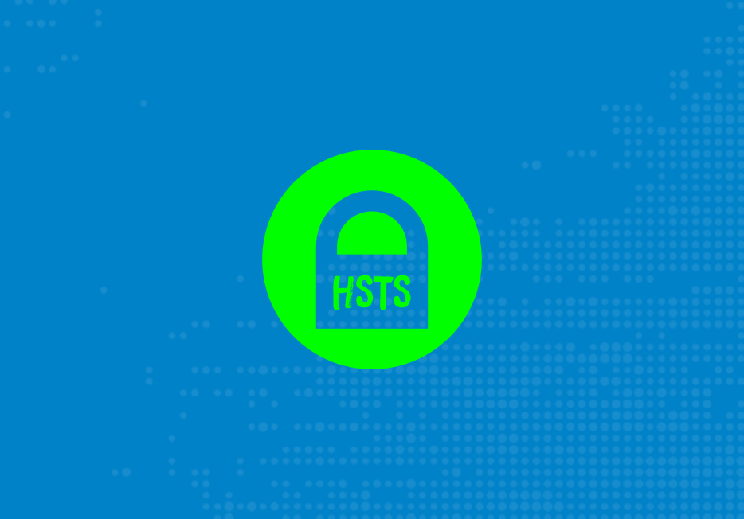

# HSTS Manager

Adds the [Strict-Transport-Security] (HSTS) header to [Nextcloud] responses,
for installations that cannot set it via the web server configuration itself
(e.g. no access to `.htaccess` or the vhost config).

## Fork notice

This project is a fork of [cloud_hsts] ("HSTS Header") by Klaus Herberth
([sualko]), renamed to **HSTS Manager**. All credit for the original app goes
to him.

It is now maintained by **Andreas Weller, DF1PAW**
([weller@andreas-weller.de](mailto:weller@andreas-weller.de)).

## Features

- Adds the `Strict-Transport-Security` header automatically over HTTPS
- Skips itself if `mod_headers` (or an equivalent) is already available, to
  avoid duplicate headers
- Fully configurable from the **admin settings GUI** — no shell or file
  access required
- Still supports the classic `config.php` system-value configuration, which
  takes precedence over the GUI for locked-down setups

## Requirements

- Nextcloud 20 – 34

## Installation

1. Download this app, extract it into your Nextcloud `apps/` directory and
   enable it **or** install it directly from the Nextcloud App Store.
2. Open your Nextcloud instance via **HTTPS**.
3. Done — the header is added automatically.

You can verify everything is working with the [Security Header Scan].

## Configuration

### Via the admin GUI (recommended)

Go to **Settings ▸ Administration ▸ Security** and adjust:

- **Max age** — how long (in seconds) browsers should remember to only use
  HTTPS for this domain
- **Include subdomains** — apply the rule to all subdomains as well
- **Preload** — mark the domain for submission to the
  [HSTS preload list]

### Via config.php

Alternatively, and taking precedence over the GUI, you can set the following
system values in `config/config.php`:

| Option | Type | Default | Description |
| --- | --- | --- | --- |
| `hsts.maxAge` | number | `15768000` (½ year) | Expiry time in seconds |
| `hsts.includeSubDomains` | boolean | `false` | Apply the rule to all subdomains |
| `hsts.preload` | boolean | `false` | Allow submission to the [HSTS preload list] |

Any value set here overrides the corresponding GUI setting, so a sysadmin can
still lock the configuration down at the file level.

## Contributing / Issues

Bug reports and pull requests are welcome at
[github.com/df1paw/cloud_hsts](https://github.com/df1paw/cloud_hsts).

## License

AGPL-3.0, see [LICENSE](https://github.com/df1paw/cloud_hsts/blob/master/LICENSE).

[Nextcloud]: https://nextcloud.com
[Strict-Transport-Security]: https://developer.mozilla.org/en-US/docs/Web/HTTP/Headers/Strict-Transport-Security
[Security Header Scan]: https://securityheaders.com
[HSTS preload list]: https://hstspreload.org
[cloud_hsts]: https://github.com/sualko/cloud_hsts
[sualko]: https://github.com/sualko
